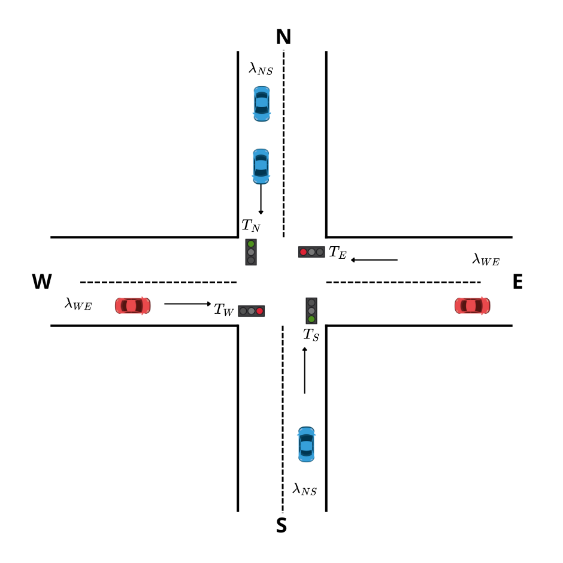

# Basic Traffic Light Intersection Simulation

This project simulates a simple `plus`-shaped intersection in SUMO, where vehicles move **north-south** and **east-west** (and vice versa), regulated by a **static traffic light** with green, yellow and red phases.

<div style="display: flex; gap: 40px;">
  
  
</div>

## Project Structure

### `configs` Folder
Contains all the configuration files required to run simulations with SUMO. Specifically:

| File | Description |
|------|-------------|
| `connections.con.xml` | Defines lane connections between roads |
| `edges.edg.xml` | Describes road segments (edges) |
| `nodes.nod.xml` | Defines nodes (intersections or points) |
| `poisson_config.sumocfg` | Main simulation config file |
| `poisson_routes.rou.xml` | Vehicle flows based on Poisson arrival |
| `trafficlight.tll.xml` | Traffic light phases and durations |
| `tripinfo.xml` | Simulation output with trip statistics |

---

### `scripts` folder
Contains Python scripts to launch SUMO simulations and analyze results:

- `run_sumo.py`: runs a basic simulation, that can also be run with a gui showing the process in real-time.
- `run_sumo_warmup.py`: runs numerous basic simulations, and generates serial time graphs tto help detect the lenght of the warmup period.
- `run_sumo_fairness.py`: runs simulations focused on analyzing fairness of waiting and travel times across traffic flows.
- `setup_and_run.sh`: bash script automating the execution of simulations by calling the Python scripts.

---

### `simulation` folder
Contains Python modules supporting simulation data processing and management:

- `simulation_utils.py`: utility functions to process SUMO data.
- `traffic_flow.py`: defines classes to model and generate traffic flows with stochastic arrival times.


---

## Traffic Light Logic

The intersection uses a **4-phase static traffic light** where the basic setup is the following:

1. **North-South green** — 30 seconds  
2. **North-South yellow** — 5 seconds  
3. **East-West green** — 30 seconds  
4. **East-West yellow** — 5 seconds  

---

## Traffic Flows

Defined in `poisson_routes.rou.xml`:

| Direction | Vehicles/min | λ (vehicles/s) | Speed (km/h) |
|-----------|---------------|----------------|---------------|
| North-South | 10 | λ<sub>NS</sub> = 0.167 | 50 |
| East-West | 6 | λ<sub>EW</sub> = 0.1 | 30 |


Each simulation runs for **10800 seconds** (3 hours), plus an optional warm-up period.

---

## Requirements

Python or python3 and [SUMO](https://eclipse.dev/sumo/) must be installed. Python dependencies are listed in `requirements.txt` and are installed automatically by the setup script.

---

## Running the Simulation

Once all files are in place, run once:

```
chmod +x setup_and_run.sh
```

And then run
```
./setup_and_run.sh
```
or
```
./setup_and_run.sh gui
```
to run the simulation. This will build the SUMO network and start the simulation.

You can change the script being executed by accessing the file `script/setup_and_run.sh` and add a comment o remove one to chose the script to run.

```
$PYTHON -m scripts.run_sumo_warmup
$PYTHON -m scripts.run_sumo_fairness
$PYTHON -m scripts.run_sumo "$@"
```

It is best to run just one script at a time, and only the run_sumo script accepts the argument `gui`.

---

## Results Analysis

After each simulation run, you can analyze the results in `tripinfo.xml`. The analysis includes:

- Number of vehicles simulated
- Waiting time at traffic lights
- Trip duration
- Time loss
