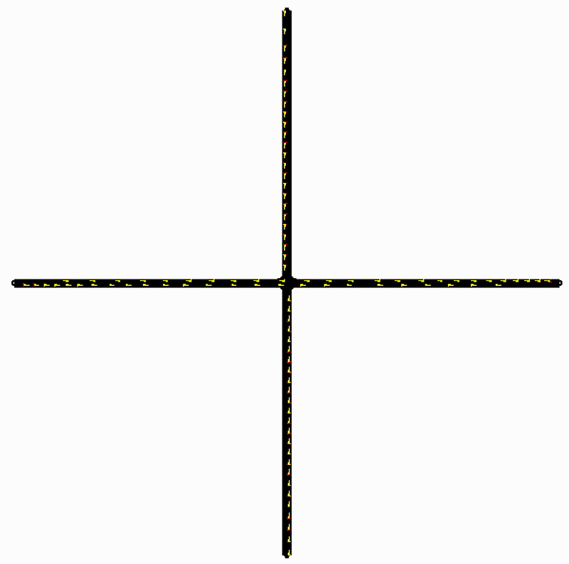

# Basic Traffic Light Intersection Simulation

This project simulates a simple `+`-shaped intersection in SUMO, where vehicles move **north-south** and **east-west** (and vice versa), regulated by a **static traffic light** with green and yellow phases.



## Project Structure

| File                   | Description                                               |
|------------------------|-----------------------------------------------------------|
| `nodes.nod.xml`        | Defines the nodes (intersections or road endpoints).      |
| `edges.edg.xml`        | Describes the roads (edges) connecting the nodes.         |
| `connections.con.xml`  | Specifies allowed movements between edges at the junction.|
| `trafficlight.tll.xml` | Sets the traffic light logic, including green/yellow phases.|
| `routes.rou.xml`       | Contains vehicle types, routes, and traffic flows.        |
| `config.sumocfg`       | Main configuration file for running the simulation.       |
| `setup_and_run.sh`     | Script to build the network and run the simulation.    
| `setup_and_run_wnds.sh`| Script to build the network and run the simulation on windows.|
| `run_sumo.py`          | main Python script that launches the SUMO simulation.     |

---

## Traffic Light Logic

The intersection uses a **4-phase static traffic light**:

1. **North-South green** — 30 seconds  
2. **North-South yellow** — 5 seconds  
3. **East-West green** — 30 seconds  
4. **East-West yellow** — 5 seconds  

---

## Traffic Flows

The file `routes.rou.xml` defines vehicle flows in the following directions:

- **North → South**
- **South → North**
- **West → East**
- **East → West**

Each flow starts at second `0`, ends at `10800` (3 hours).

---

## Running the Simulation

Once all files are in place, run once:

```
chmod +x setup_and_run.sh
```

And then run
```
./setup_and_run.sh
```
or
```
./setup_and_run.sh gui
```
to run the simulation

This will build the SUMO network and start the simulation.

---

## Results Analysis

After the simulation, you can analyze the results in `tripinfo.xml` using the functions in `simulation_utils.py`. The analysis includes:

- Number of vehicles simulated
- Average waiting time at traffic lights
- Average trip duration
- Average time loss

---

## Requirements

Python 3 and SUMO must be installed. Python dependencies are listed in `requirements.txt` and are installed automatically by the setup script.
